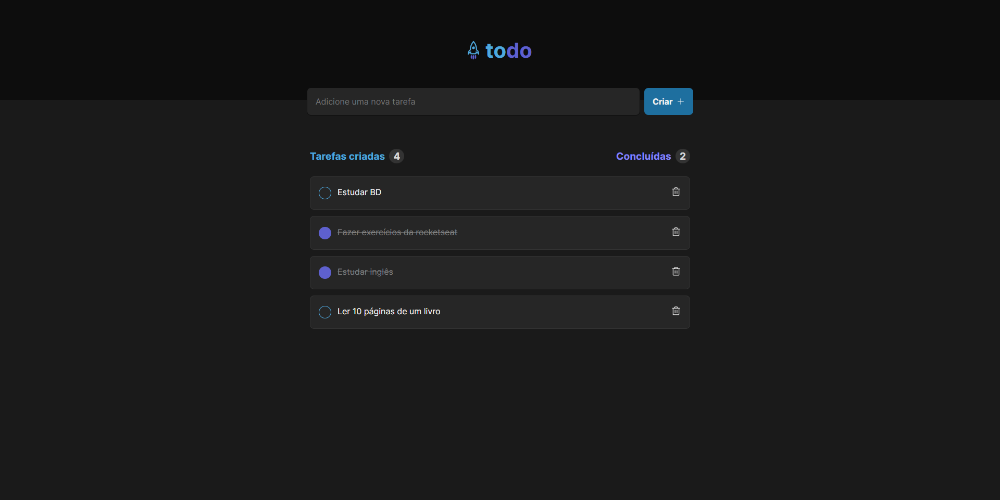

<h1 align="center"> Todo App | Ignite </h1>

Projeto desenvolvido através de um desafio do 1º módulo do programa Ignite da Rocketseat 

  <a href="#-tecnologias">Tecnologias</a>&nbsp;&nbsp;&nbsp;|&nbsp;&nbsp;&nbsp;
  <a href="#-projeto">Projeto</a>&nbsp;&nbsp;&nbsp;|&nbsp;&nbsp;&nbsp;
  <a href="#-licença">Licença</a>

  

  <a href="https://ignite-todo-silk.vercel.app/" target="_blank">➡️ Acesse o deploy!</a>

## 🚀 Tecnologias

Esse projeto foi desenvolvido com as seguintes tecnologias:

-   React
-   Typescript
-   Vite
-   Git e Github

## 💻 Projeto

O projeto é um Todo básico onde você pode adicionar uma nova atividade, excluir ou marcar como concluída, além de trazer dados de quantas tarefas foram criadas e quantas estão concluídas.

## 🔘 Licença

Esse projeto está sob a licença MIT.

---

Made with 💙 by Rafael Ramos
